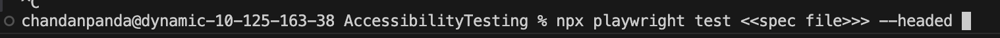
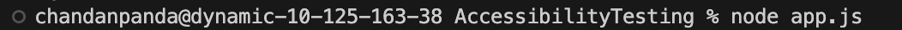
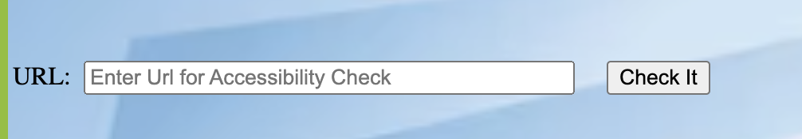

# AccessibilityTesting
To run single file from local : npx playwright test "spec_file" --headed  

    

To run from browser follow below steps:
1. node app.js  (To start server).

    

2. Open index.html in browser (i.e. right click on index.html and click on Open with live server).
3. Pass the URL for which you need to check accessibility in Input text.

    
    $
4. Click on Check It button.
5. Click on compare where you want to compare the elements.

